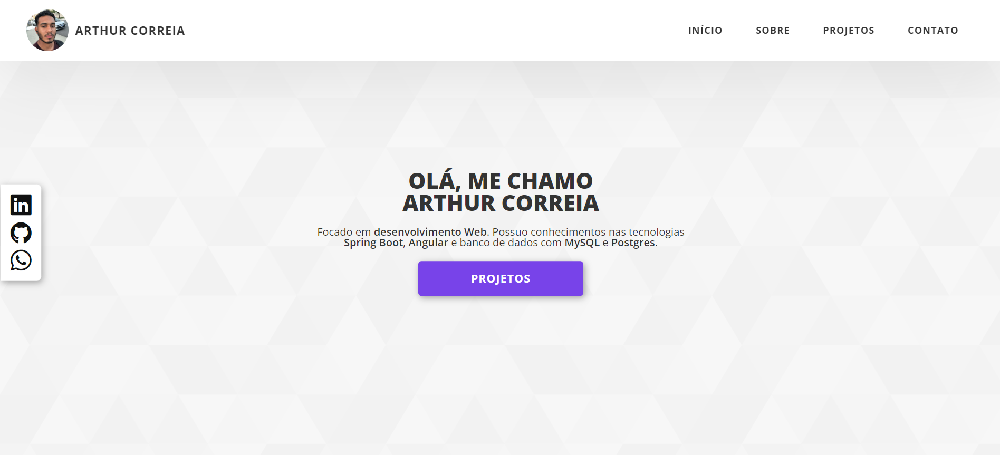

  

<h1  align="center" style="font-weight: bold;">Portfólio 💻</h1>

## 👋🏾 Sobre Mim

Olá! Eu sou um desenvolvedor web e atualmente, estou cursando o 6º semestre de Sistemas de Informação e possuo experiência tanto no desenvolvimento front-end quanto no back-end. Focado no desenvolvimento de APIs RESTful utilizando Spring Boot e na criação de interfaces de usuário com Angular.

## 🚀 O que você encontrará

No meu portfólio você vai conhecer um pouco da minha história e objetivos além de visualizar alguns dos meus projetos mais legais.
- Link para acesso: <a href="https://portfolio-artu.web.app/" target="_blank">portfolio-artucorreia</a> 

## 💻 Tecnologias Utilizadas

## 📃 Licença

Este software está disponível sob as seguintes licenças:

- [MIT](https://rem.mit-license.org)
